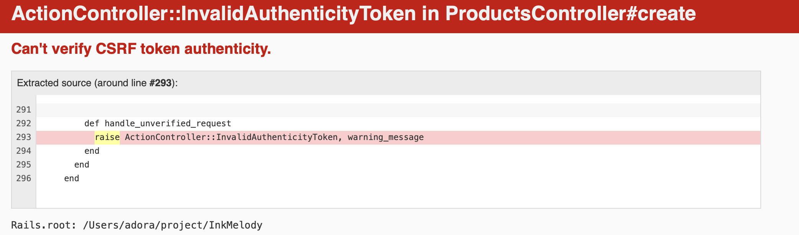

# Ruby on Rails

2023/11/21

## URL helper

在`routes.rb`使用`as: :about`

好處：統一管理、容易改變路徑、容易偵錯

```Ruby
# routes.rb
# 之後不管改什麼都ok
get "about_us", to: 'pages#about', as: :about
```

```Ruby
# index.html.erb
<a href="<%= about_path %>" about></a>
```

## 使用 url, path 的差別？

- url 較容易分享
- 站內使用 path 即可

## 其他小幫手

### 連結小幫手

```ruby
<%= link_to "About", about_path %>
#1：要看到什麼, 2:要連去哪
```

使用`about_path`能夠連動

為什麼要用框架？方便

| 路徑               |  意思  |
| :----------------- | :----: |
| RESOURCEs/         | 列表頁 |
| /RESOURCEs/new     |  新增  |
| /RESOURCEs/id      |  檢視  |
| /RESOURCEs/id/edit |  編輯  |

## 新增商品

```ruby
# index.erb.html
<a href="/products/new">新增商品</a>
```

```ruby
#routes.rb
get "/products/new", to: 'products#new'
```

```terminal
$ rails g controller products
```

````ruby
# views>products>
# 新增 new.html.erb檔案

```ruby
# ProductsController.rb
class ProductsController < ApplicationController
  def new
  end
end

````

bin-dev

## action

```html
<form action="/product/create" method=""></form>
```

"action=""希望送出會到 create 表單內 /RESOURCE/new-> /RESOURCE/create

## method

### HTTP Verb 動詞

預設值 GET ; 總共有：GET / POST / HEAD / PATCH / PUT / DELETE

RESTFUL API 表現層狀態轉換

[Wiki 說明 RESTFUL API](https://zh.wikipedia.org/zh-tw/%E8%A1%A8%E7%8E%B0%E5%B1%82%E7%8A%B6%E6%80%81%E8%BD%AC%E6%8D%A2)

| 項目 | hTTP Verb |     意思 |
| :--- | :-------: | -------: |
| 1    |    GET    |     讀取 |
| 2    |   POST    |     新增 |
| 3    |   PATCH   | 更新欄位 |
| 4    |    PUT    | 更新整筆 |
| 5    |  DELETE   |     刪除 |

必須要在輸入框加上名字才能送出

## GET v.s. POST

沒有安全的差別，但 GET 有上限的差別，網址有長度限制 POST 就沒有這個問題

## data-turbo

```ruby
<form action="/products" method="post"
data-turbo="false">
```

## CSRF



Rails 會在裡面檢查有無`authenticity_token`

```ruby
<input type="text"
         name="authenticity_token"
         value="<%= form_authenticity_token %>">
```

確定這個東西是本站送過來的

## 加強版 Hash

用這兩種都可以

```ruby
  def create
    render html: params[:price]
    render html: params["price"]
  end
```

改導至頁面

```ruby
  def create
    redirect_to root_path
  end
```

## Model?

- 可以透過 Model 翻譯，和資料庫(DB)溝通
- 資料庫的代理人

### 為什麼 DB 都畫成柱狀圖？

因為早期資料庫硬體形狀為柱狀體

Product

- title string
- description text
- price decimal(帶有小數點的數字)

```terminal
$ rails g model Product title:string description:text price:decimal
```

-string 可以省略

# 生成表格

表格名字：小寫副數 **products**, Model：大寫單數 **Product**

```ruby
# /db/migrate/20231120070347_create_products.rb
class CreateProducts < ActiveRecord::Migration[7.1]
  def change
    create_table :products do |t|
      t.string :title
      t.text :description
      t.decimal :price

      t.timestamps
      # t.datetime :created_at
      # t.datetime :updated_at
    end
  end
end
```

- 透過此建立表格
- 有隱藏 ID
- 會有六個欄位
- 之後新增修改刪除都是透過 migration

# migration

- 紀錄 db 的成長紀錄
- 一個資料庫可以有很多資料表
- 要先定義一個變數為 p1 使用 new 呼叫 class

- 進入沙盒模式練習

```terminal
$ rails c --sandbox
```

```terminal
$ p1 = Product.new
```

```terminal
$ p1.save
```

- 所有資料

```terminal
$ Product.all
```

把 name 改成 product[price]

control

```ruby
  def create
    # redirect_to root_path

    # params存入資料庫
    product = Product.new(params[:product])
    render html: params
  end
```
